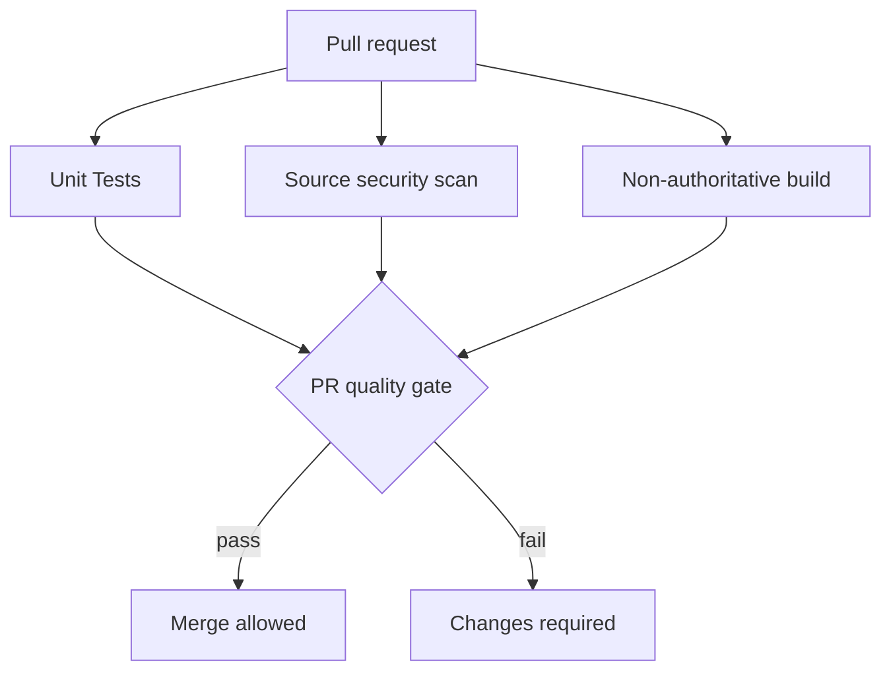
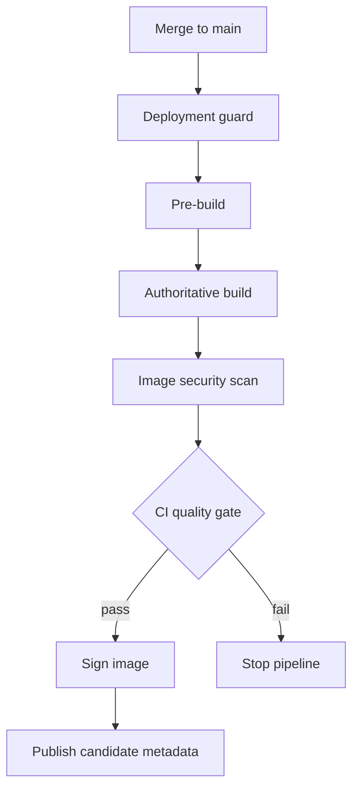
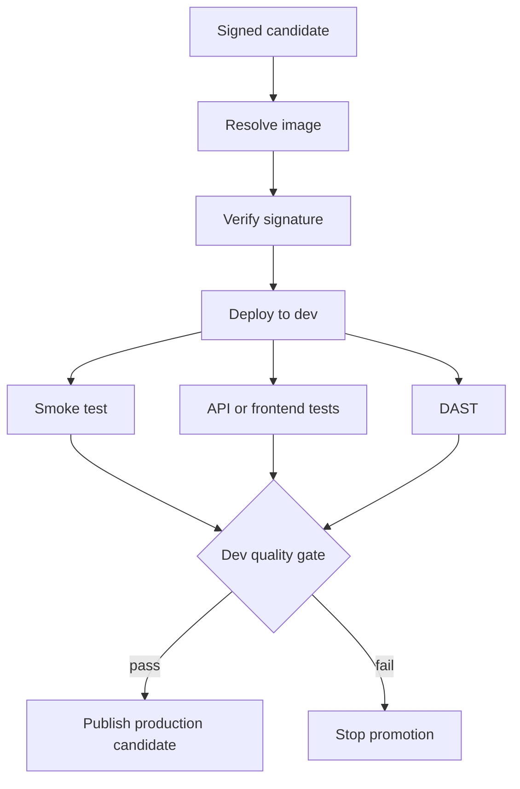
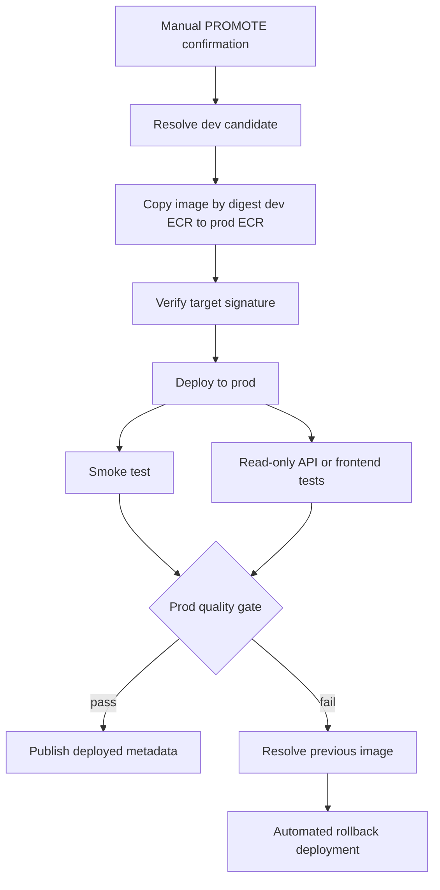

# SparrowX DevSecOps Controls and Delivery Pipeline

SparrowX uses a standardized DevSecOps delivery model across all application repositories. The `customer-api` repository is the reference implementation for the workflow composition described here. The same pattern is used by the other APIs and by the web portal, with runtime-specific settings for Python, Node.js, database access, frontend builds, and deployed tests.

The application repositories keep only a thin layer of service-specific workflow composition. The common security, build, deployment, testing, signing, promotion, and rollback behavior is implemented in the reusable workflows repository. This makes the secure delivery path consistent and makes onboarding a new application primarily a matter of supplying its source, tests, Dockerfile, environment parameters, and security policy.

## Table of contents

- [Delivery lifecycle](#delivery-lifecycle)
- [Stage 1: Pull-request validation](#stage-1-pull-request-validation)
  - [Quality gate](#quality-gate)
- [Stage 2: CI after merge](#stage-2-ci-after-merge)
  - [Authoritative and non-authoritative builds](#authoritative-and-non-authoritative-builds)
  - [Quality gate](#quality-gate-1)
- [Stage 3: Automated development deployment](#stage-3-automated-development-deployment)
  - [Quality gate](#quality-gate-2)
- [Stage 4: Manual production promotion](#stage-4-manual-production-promotion)
  - [Quality gate](#quality-gate-3)
- [Reusable security and delivery workflows](#reusable-security-and-delivery-workflows)
- [Security outcomes and remediation evidence](#security-outcomes-and-remediation-evidence)
  - [Measured findings](#measured-findings)
  - [Remediation branches](#remediation-branches)
- [Rollback paths](#rollback-paths)
- [Standardization and onboarding](#standardization-and-onboarding)

## Delivery lifecycle

The normal lifecycle has four delivery stages:

```text
Pull request
    │
    ▼
1. PR validation
    │ merge to main
    ▼
2. CI after merge
    │ successful candidate publication
    ▼
3. Automated development deployment
    │ successful development validation
    ▼
4. Manual production promotion
    │ production validation
    ├── publish deployed metadata
    └── automatically roll back if the production gate fails
```

Rollback is available at multiple points and is described separately below. The production workflow also has an optional manual rollback workflow for urgent recovery to a selected immutable image.

## Stage 1: Pull-request validation

Workflow runs: [customer-api PR validation](https://github.com/SparrowX-ECS/customer-api/actions/workflows/pr-validation.yaml)

This stage runs for pull requests targeting `main`. It validates the proposed source change before it can be merged.



| Job | Purpose |
| --- | --- |
| `test` | Runs the application test suite. For database-backed APIs, it can provision and use PostgreSQL during the test job. |
| `source-security-scan` | Runs source-level security checks, including the configured static and repository security controls. |
| `build` | Builds the application image in non-authoritative mode to verify that the Dockerfile and application package correctly. |
| `pr-quality-gate` | Aggregates the test, source-security, and build results and evaluates them against `app-sec-policy.yaml`. |

### Quality gate

The PR quality gate must pass before the change is considered mergeable. It prevents broken builds and policy-violating source changes from entering `main`.

The gate is driven by the artifacts emitted by the source-security scan and the result of the test and build jobs. Each application repository supplies its own security policy file, while the gate logic remains centralized.

## Stage 2: CI after merge

Workflow runs: [customer-api CI after merge](https://github.com/SparrowX-ECS/customer-api/actions/workflows/ci.yaml)

This stage runs after a change is merged to `main`. It creates the authoritative, immutable release candidate that will later be deployed and promoted.



| Job | Purpose |
| --- | --- |
| `deployment-guard` | Reads the application `appStack.state` and infrastructure `RootStack.State`; deployment is enabled only when both are `enabled`. |
| `pre-build` | Detects whether a build is needed and prepares the build decision. |
| `build` | Performs the authoritative image build and publishes the image using an immutable commit-SHA tag. |
| `image-security-scan` | Scans the built container image for vulnerabilities and produces the scan artifact. |
| `ci-quality-gate` | Evaluates the image scan artifact against `app-sec-policy.yaml`. |
| `sign-image` | Signs the image after the CI security gate has passed. |
| `publish-image-metadata` | Publishes the signed candidate image tag, URI, and digest to SSM Parameter Store for later deployment and promotion. |

### Authoritative and non-authoritative builds

The PR validation build is **non-authoritative**. It verifies that the application can be packaged into a valid container, but it is not the release artifact used by later environments. It is safe to run as an early feedback check and does not establish the image that will be promoted.

The post-merge CI build is **authoritative**. It is the official release build for the commit that entered `main`. It publishes the immutable commit-SHA image, which is scanned, signed, recorded in SSM Parameter Store, deployed to development, and eventually promoted to production.

This distinction prevents a pull-request validation image from being mistaken for a release artifact while ensuring that the artifact used in later stages is created only after the change has merged and passed the CI controls.

### Quality gate

The CI quality gate blocks image publication as a deployable candidate when the image scan violates the repository policy. Image signing and metadata publication depend on this gate, so an unsigned or non-compliant image cannot proceed through the normal delivery path.

The image is built once authoritatively with an immutable commit-SHA identity. Later stages resolve, verify, deploy, copy, and promote that same image tag and digest rather than rebuilding it.

This is the **Build Once, Promote Many** model:

1. CI builds one authoritative image after merge.
2. The image is scanned and signed before it becomes a candidate.
3. Development deploys and validates that exact image.
4. Production promotion copies that exact image by digest from the development ECR namespace to the production namespace.
5. Production deploys the copied artifact without running another application build.

Because the artifact is immutable and its digest is carried through the workflow, a successful production deployment is traceable to the exact image that passed CI and development validation.

## Stage 3: Automated development deployment

Workflow runs: [customer-api automated development deployment](https://github.com/SparrowX-ECS/customer-api/actions/workflows/deploy-dev.yaml)

This workflow is triggered after the CI workflow completes successfully on `main`. It deploys the signed candidate to the development environment and validates the running service.



| Job | Purpose |
| --- | --- |
| `deployment-guard` | Confirms that both application and infrastructure deployment switches are enabled. |
| `resolve-image` | Resolves the candidate image tag, URI, and digest from SSM metadata. |
| `verify-image-signature` | Verifies that the resolved image has a valid signature before deployment. |
| `deploy` | Deploys the immutable image to ECS/Fargate using the development environment parameters. |
| `smoke-test` | Verifies the deployed service health endpoint and deployment availability. |
| `api-test` | Runs the development API or frontend integration tests against the deployed service. |
| `dast` | Runs dynamic application security testing against the deployed development service. API services may provide a routed OpenAPI document to improve endpoint discovery. |
| `dev-quality-gate` | Aggregates smoke-test, API-test, and DAST results and evaluates the security policy. |
| `publish-image-metadata` | Publishes the validated image as the production candidate when the development gate passes. |

### Quality gate

The development quality gate requires the deployment smoke test, deployed API/frontend tests, and DAST result to satisfy the configured policy. Only after this gate passes is the image recorded as the production candidate.

This stage validates the actual immutable image in an environment that is close to production, rather than relying only on build-time checks.

## Stage 4: Manual production promotion

Workflow runs: [customer-api manual production promotion](https://github.com/SparrowX-ECS/customer-api/actions/workflows/promote-prod.yaml)

Production promotion is intentionally manual. An operator starts the workflow and enters the required `PROMOTE` confirmation.



| Job | Purpose |
| --- | --- |
| `confirm-promotion` | Requires explicit operator confirmation. |
| `deployment-guard` | Confirms that both application and infrastructure deployment switches are enabled. |
| `resolve-image` | Resolves the development candidate tag and digest. |
| `copy-image` | Copies the exact image by digest from the development ECR namespace to the production ECR namespace. |
| `verify-target-image-signature` | Verifies the signature of the production-target image. |
| `promote` | Deploys the immutable image to the production ECS service. |
| `smoke-test` | Checks production service health after deployment. |
| `api-test` | Runs production validation tests. These are intended to be read-only for production environments. |
| `prod-quality-gate` | Requires the production smoke test and production API/frontend tests to pass. |
| `publish-image-metadata` | Records the successfully deployed production image as the current deployed artifact. |

### Quality gate

The production quality gate prevents deployment metadata from being published when the deployed service does not pass its post-deployment checks. Production receives the exact image that passed development validation; it is not rebuilt during promotion.

## Reusable security and delivery workflows

The reusable workflows are maintained in the [`workflows-templates`](https://github.com/SparrowX-ECS/workflows-templates) repository and referenced by application repositories at a versioned tag such as `@v5.1.0`. Each reusable workflow has its own documentation in the `workflows-templates` repository, including its inputs, outputs, permissions, expected artifacts, and usage contract.

The key reusable controls are:

- `test.yaml`: standardized application tests for Python and Node.js workloads, with optional database support.
- `source-security-scan.yaml`: source-level security scanning for pull requests.
- `build.yaml`: standardized Docker builds, frontend builds, immutable image tags, and ECR publication.
- `image-security-scan.yaml`: Trivy-based container image scanning.
- `ci-quality-gate.yaml`: policy-based CI gate for image-security results.
- `sign-image.yaml`: image signing after the CI gate passes.
- `verify-image-signature.yaml`: signature verification before deployment or promotion.
- `deployment-guard.yaml`: environment deployment enablement and guard checks.
- `resolve-image.yaml`: resolution of candidate, deployed, and previous image metadata.
- `deploy.yaml`: standardized ECS/Fargate deployment.
- `smoke-test.yaml`: post-deployment health validation.
- `api-test.yaml`: deployed API or frontend test execution.
- `dast.yaml`: dynamic application security testing against a deployed environment.
- `dev-quality-gate.yaml`: development deployment gate combining smoke, API, and DAST results.
- `prod-quality-gate.yaml`: production post-deployment gate.
- `copy-image.yaml`: digest-preserving promotion from the development ECR namespace to production.
- `publish-image-metadata.yaml`: publication of immutable image metadata to SSM Parameter Store.

This separation keeps security and delivery behavior standardized across all application repositories while allowing each repository to configure its runtime, test command, database requirement, API specification path, and environment parameter files.

## Security outcomes and remediation evidence

The controls produced concrete security improvements across the Python APIs and the web portal:

- **Python APIs:** upgraded FastAPI/AnyIO dependencies; added HSTS, Referrer Policy, and Permissions Policy headers; removed the Uvicorn server header; added routed OpenAPI endpoints for DAST; normalized metrics labels; and made production API tests read-only.
- **Frontend:** patched Alpine runtime packages; added CSP and HSTS headers; and disabled Nginx version disclosure.

### Measured findings

The table combines the supplied Python API before/after scan results with the web-portal pre-remediation reports. The remaining Python image findings are OS-package findings inherited from the container base image and require a newer patched base image or upstream package release.

| Scanner | Baseline findings | Remediation | Post-fix target |
| --- | ---: | --- | ---: |
| Frontend Trivy image scan | 3 HIGH, 0 CRITICAL | Upgrade Alpine runtime packages, including `expat`, `pcre2`, and `libtiff`. | 0 HIGH, 0 CRITICAL |
| Python API Trivy image scans | 48 findings: 1 CRITICAL, 47 HIGH | Upgrade FastAPI/AnyIO dependencies and rebuild the Python API images. | 44 findings: 0 CRITICAL, 44 HIGH; 4 findings remediated, including the CRITICAL finding. The remaining findings are OS-package findings from the base image. |
| DAST | **Before:** Python ZAP API scan — 15 total: 0 HIGH, 3 MEDIUM, 8 LOW, 4 informational; target was `/openapi.json`. | Add routed OpenAPI discovery and the implemented API/frontend security headers and server hardening. | **After:** Python ZAP API scan — 11 total: 0 HIGH, 0 MEDIUM, 6 LOW, 5 informational; actionable findings reduced from 11 to 6. Node ZAP site scan — 4 total: 0 HIGH, 1 MEDIUM, 0 LOW, 3 informational. |

The ZAP reports also contain informational observations about modern web applications and cacheability. These are not vulnerability findings and are handled through normal cache and application review rather than the blocking vulnerability threshold.

### Remediation branches

The application-specific fixes are captured in these branches:

| Repository | Security-fix branch |
| --- | --- |
| `customer-api` | [`fix/14-fix-security-vulnerabilities`](https://github.com/SparrowX-ECS/customer-api/tree/fix/14-fix-security-vulnerabilities) |
| `notification-api` | [`fix/4-fix-security-vulnerabilities`](https://github.com/SparrowX-ECS/notification-api/tree/fix/4-fix-security-vulnerabilities) |
| `task-api` | [`fix/4-fix-security-vulnerabilities`](https://github.com/SparrowX-ECS/task-api/tree/fix/4-fix-security-vulnerabilities) |
| `billing-api` | [`fix/5-fix-security-vulnerabilities`](https://github.com/SparrowX-ECS/billing-api/tree/fix/5-fix-security-vulnerabilities) |
| `reporting-api` | [`fix/6-fix-security-vulnerabilities`](https://github.com/SparrowX-ECS/reporting-api/tree/fix/6-fix-security-vulnerabilities) |
| `web-portal` | [`fix/4-fix-security-vulnerabilities`](https://github.com/SparrowX-ECS/web-portal/tree/fix/4-fix-security-vulnerabilities) |

## Rollback paths

SparrowX provides four recovery paths. The first path is an ECS capability; ECR stores immutable images but does not perform deployment rollback.

### 1. ECS automatic rollback on a failing deployment

The ECS service deployment circuit breaker can detect an unhealthy rolling deployment and automatically return the service to its previous healthy task definition. This protects against failures during task startup, health checks, or service stabilization.

### 2. Automated rollback from the production pipeline

If the production deployment completes but the production smoke test or production API/frontend tests fail, `prod-quality-gate` fails. The production workflow then resolves the previous deployed image from SSM and runs the standardized deployment workflow to restore it.

This is a pipeline-level rollback after post-deployment validation, complementing the ECS deployment circuit breaker.

### 3. Rollback through a Git revert

If the desired correction is a source or configuration change, the team can revert the problematic commit and merge the revert. The normal PR, CI, development deployment, and promotion controls then validate and deliver the corrective state.

### 4. Optional manual rollback to a selected image

`rollback-prod.yaml` supports urgent recovery without rebuilding. An operator enters `ROLLBACK` and supplies a specific immutable image tag. The workflow verifies the deployment guard, deploys that selected image to production, and runs the production smoke test.

This path is useful when a known-good previous image must be restored quickly while the underlying source issue is investigated.

## Standardization and onboarding

All application repositories follow the same control structure:

1. Validate source changes on pull requests.
2. Build and scan one immutable artifact after merge.
3. Sign and verify the artifact before deployment.
4. Deploy automatically to development and validate the running service.
5. Promote the exact validated artifact to production with manual approval.
6. Retain ECS, pipeline, Git, and manual image rollback options.

The reusable workflow approach makes this pattern smooth to apply. A new service does not need to reimplement security scanning, image signing, environment promotion, deployment checks, or rollback logic. It composes the shared workflows and supplies only the service-specific parameters and test interfaces.
